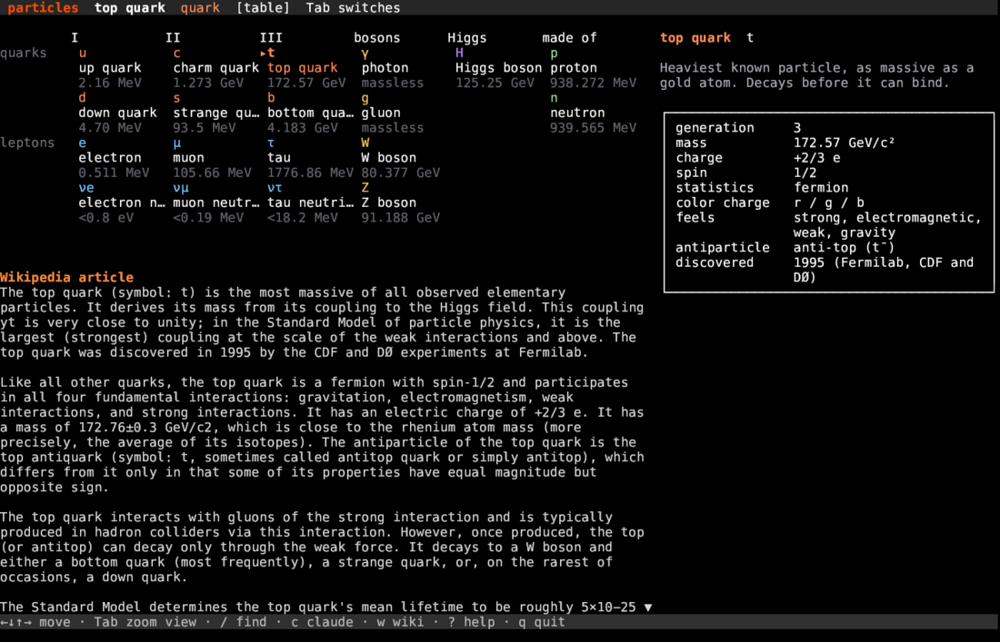
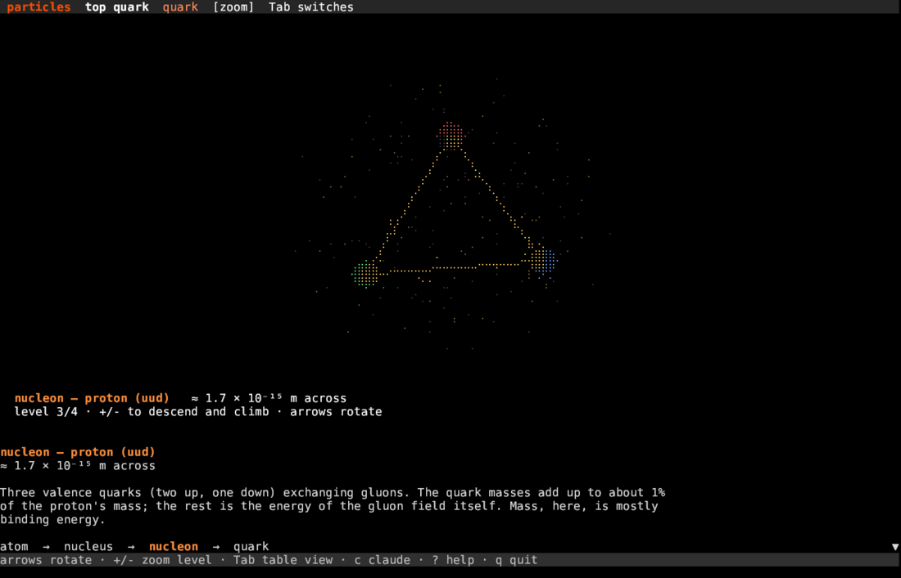
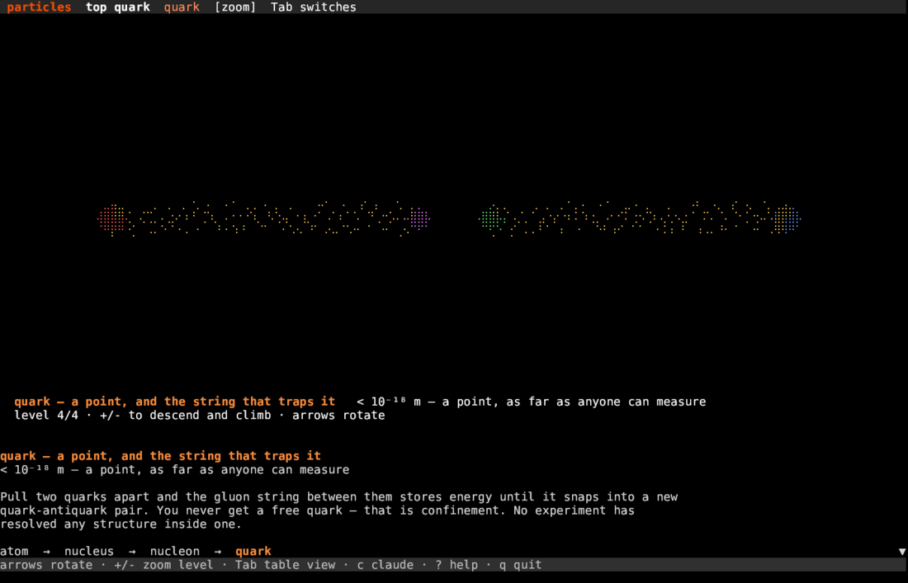

# particles



**The Standard Model in your terminal, and a zoom from an atom down to the quarks. Written in Rust.**

   

Two views. The chart lays out the seventeen fundamental particles the way every physics poster does, three generations across, with each one's mass, charge, spin, color charge and full Wikipedia article a keypress away. The zoom takes a carbon atom apart: nucleus, then one nucleon, then a single quark and the gluon string that will not let it go. Rotate the model with the arrow keys. Built on [Crust](https://github.com/isene/crust), part of the [Fe2O3 suite](https://github.com/isene/fe2o3).



## Features

- **The Standard Model chart**: quarks and leptons in three generations, the four gauge bosons, the Higgs, plus the proton and neutron they build
- **PDG numbers**: mass, charge, spin, color charge, which forces it feels, its antiparticle, and when it was found. The neutrino masses are the experimental upper limits, and say so
- **Zoom into an atom** (`Tab`): four levels, atom → nucleus → nucleon → quark, each labelled with its real size, drawn as a rotatable 3D point cloud in braille
- **Honest models**: carbon-12 keeps its 6 protons and 6 neutrons, the proton keeps its three valence quarks and its gluon flux tubes, and every level says out loud where the picture lies (the nucleus is drawn far too big; a quark has no size to draw)
- **Full Wikipedia article** for every particle, cached locally
- **Ask Claude** (`c`) about the particle or the zoom level you are looking at
- **Zero idle cost**: event-driven, no timers, no animation loop
- **Offline**: one fetch, then everything is local

### The zoom

Press `Tab`, then `+` to descend. A proton: three valence quarks, red, green and blue, joined by gluon flux tubes, in a dim sea of virtual pairs.



One level further down, pull two quarks apart. The string between them stores energy until it snaps into a new quark-antiquark pair, and you are left holding two mesons instead of one free quark.



## Install

Download the prebuilt binary from [Releases](https://github.com/isene/particles/releases), or build from source:

```bash
cargo build --release
cp target/release/particles ~/.local/bin/
```

First start fetches the nineteen articles (a few seconds), then the app works offline.

## Key Bindings

| Key | Action |
|-----|--------|
| Tab | Switch between the chart and the zoom |
| ← ↑ ↓ →, h/j/k/l | Move around the chart / rotate the model |
| + - | Descend / climb the zoom: atom → nucleus → nucleon → quark |
| < >, n p | Previous / next particle |
| J K, Shift+↓/↑ | Scroll the article one line |
| Space, PgUp/PgDn | Scroll the article one page |
| g G | Top / bottom of the article |
| / | Find a particle by symbol or name |
| c | Ask Claude about this particle (follow-ups keep context) |
| C | Toggle the Claude conversation view |
| w | Open the Wikipedia page in the browser |
| u | Re-fetch the articles |
| ? | Help |
| ESC | Back to the article (quits from the article view) |
| q | Quit |

## CLI

```
particles [PARTICLE] [--fetch]
```

- `PARTICLE` starts on that particle, by symbol (`t`, `H`, `νe`) or name (`top quark`, `higgs`)
- `--fetch` re-fetches the articles
- `-v` prints the version

Piped, it prints the particle's data and article as plain text, so `particles muon | grep lifetime` works.

## The zoom, level by level

| Level | Size | What it shows |
|---|---|---|
| atom | ≈ 1.4 × 10⁻¹⁰ m | carbon-12: two electron probability clouds around a nucleus drawn a hundred thousand times too large |
| nucleus | ≈ 5 × 10⁻¹⁵ m | 6 protons and 6 neutrons held by the residual strong force against their own electrical repulsion |
| nucleon | ≈ 1.7 × 10⁻¹⁵ m | a proton: three valence quarks, gluon flux tubes between them, a sea of virtual pairs. The quark masses are about 1% of the proton's; the rest is field energy |
| quark | < 10⁻¹⁸ m | pull two apart and the string snaps into a new quark-antiquark pair. You never get a free quark |

## Data

The particle table is compiled in (seventeen fundamental particles do not change) with PDG values.
Article text comes from the Wikipedia TextExtracts API and is cached at `~/.particles/particles.json`.

## License

Public domain (Unlicense). Created by Geir Isene.
